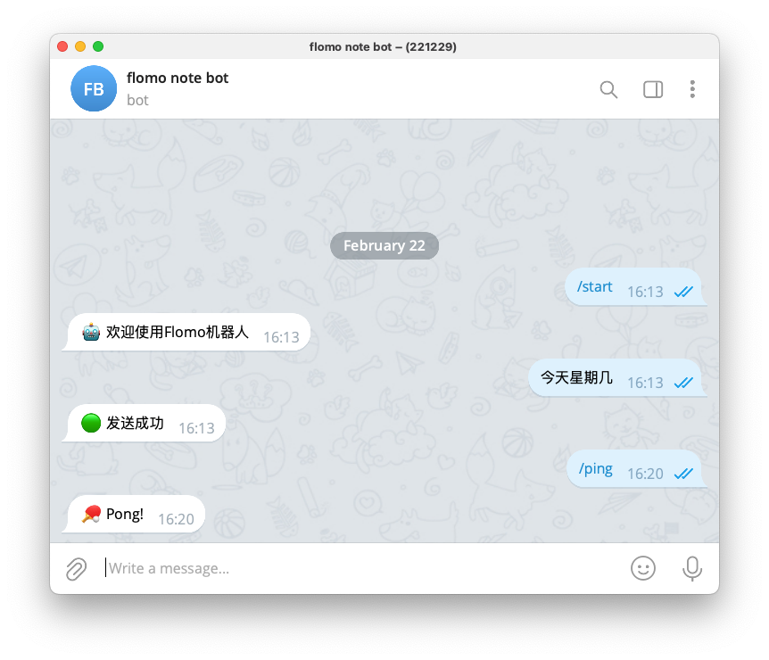

# flomo-telegram-bot


## 简介

flomo-telegram-bot 是一个使用 Go 语言编写的 Telegram 机器人，可用于与 Flomo 进行交互。它可以帮助您在Telegram快速发送你的想法到Flomo

## 体验地址

[FlomoNoteBot](https://t.me/flomo_note_bot)

## 配置

您需要配置以下环境变量：

```
FLOMO_API_URL: Flomo API URL
TG_BOT_TOKEN: Telegram Bot API 令牌
```


或者，您可以将这些配置项写入 config.yaml 文件，例如：
```yaml
flomo_api: https://flomoapp.com/xxx
tgbot_token: 123456789:xxxxxx
```
## 运行

前往[Release](https://github.com/peanut996/flomo-telegram-bot/releases)界面下载二进制文件解压运行：

```bash
./flomo-telegram-bot
```

或者Clone源码自行编译（需要提前安装Go SDK）：

```bash
git clone https://github.com/peanut996/flomo-telegram-bot
cd flomo-telegram-bot
go run .
```

## 使用

直接与机器人对话即可， 目前暂不支持图片上传，等待后续开发

额外命令支持：
+ /ping 查看机器是否存活




## 致谢

感谢以下项目： 

+ Go-Telegram-Bot-API: https://github.com/go-telegram-bot-api/telegram-bot-api
